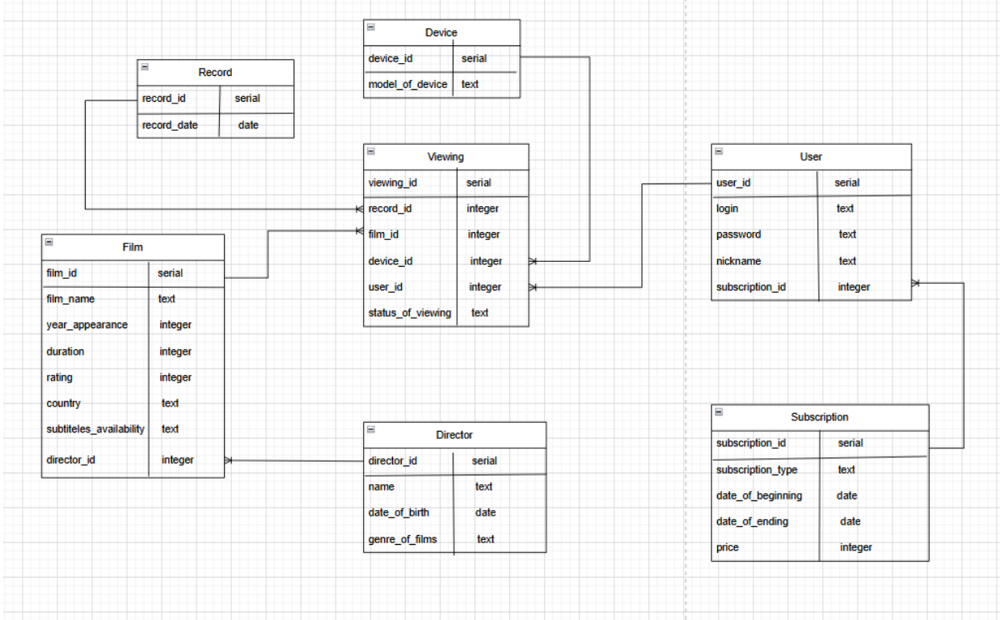

# База данных для онлайн-кинотеатра
---------------------------
## Оглавление
- [О проекте](#о-проекте)
- [Основные сущности](#основные-сущности)
- [Связи между таблицами](#связи-между-таблицами)
- [Стек технологий](#стек-технологий)
- [Реализованные запросы и триггеры](#реализованные-запросы-и-триггеры)

## О проекте
Разрабатываемая система предназначена для автоматизации процесса учета
просмотров фильмов пользователями аудиовизуального сервиса. В условиях
роста популярности платформ, которые подбирают фильмы, существует
необходимость в эффективных инструментах контроля данных о потребителях и
их предпочтениях. База данных «Онлайн-кинотеатр» предназначена для
удовлетворения перечисленных требований.
Главной целью создания базы данных является систематизация данных о
фильмах, их просмотрах и пользователях. «Онлайн-кинотеатр» включает в
себя такие сущности, как фильм, просмотр, пользователь, подписка, режиссер,
устройство и запись.
Основные задачи, решенные в проекте:
* анализ предметной области;
* выделение сущностей;
* разработка BPMN-диаграммы;
* проектирование инфологической модели базы данных;
* проектирование даталогической модели базы данных;
* заполнение базы данных;
* написание сложных запросов и триггеров.

## Основные сущности
Можно выделить следующие сущности:
* пользователь — уникальный идентификатор, логин, пароль, никнейм,
код подписки;
* подписка — содержит идентификатор подписки, тип подписки, дату
начала подписки, дату окончания подписки, сумму платежа;
* просмотр — уникальный идентификатор, ссылка на запись, ссылка на
устройство, ссылка на пользователя, ссылка на фильм, статус просмотра.
* запись — уникальный идентификатор и дата записи;
* устройство — содержит идентификатор устройства и модель
устройства;
* фильм — уникальный идентификатор, название, год, длительность,
рейтинг, страна-производитель, наличие субтитров, ссылка на режиссера;
* режиссер — уникальный идентификатор, ФИО, дата рождения, жанры.

## Связи между таблицами

## Стек технологий
| Категория | Технологии |
| :--- | :--- |
| **СУБД** | PostgreSQL |
| **Инструменты** | pgAdmin 4 |
| **Языки** | SQL, Python |
| **Библиотеки Python** | `psycopg2`, `Faker`, `random`, `datetime` |
| **Моделирование** | ER-диаграммы, BPMN |

## Реализованные запросы и триггеры
В рамках работы были реализованные следующие запросы:
- запрос для получения пользователей, просмотревших больше всего
фильмов;
- запрос для получения фильмов, которые были просмотрены только в
последний месяц;
- запрос для получения страны с наибольшим количеством просмотров;
- запрос для получения фильмов, не просмотренных ни одним
пользователем;
- запрос для нахождения пользователей с подпиской, истекающей в этом
месяце;
- запрос для нахождения пользователей, которые не смотрели фильмы
больше месяца.

Также были реализованы следующие триггеры:
- триггер для проверки того, что возраст режиссера выше 18;
- триггер для вывода уведомления об изменении подписки пользователя.

